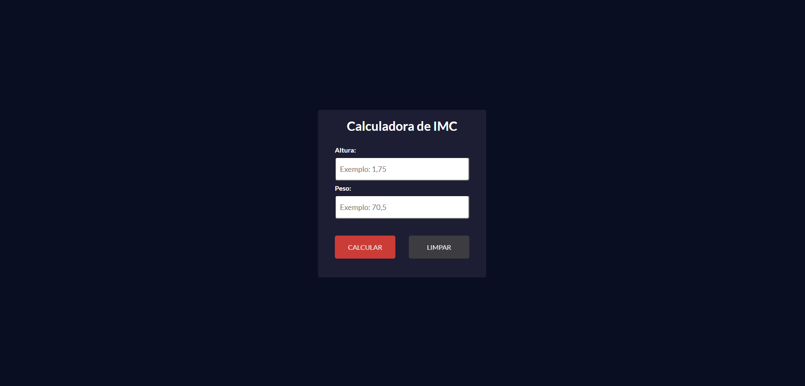

Aqui está a explicação sobre como funciona o **IMC Calculator App**:

# Calculadora de IMC

# Resultado calculadora de IMC

### **Estrutura Geral**
O **IMC Calculator App** permite ao usuário calcular o Índice de Massa Corporal (IMC) com base na altura e peso fornecidos. A aplicação exibe o valor do IMC calculado e sua classificação (Magreza, Normal, Sobrepeso, etc.), conforme a tabela de classificação da OMS.

### **Fluxo de Funcionamento**

1. **Entrada de Dados (ImcForm.jsx)**
   - O formulário solicita ao usuário que insira sua **altura** e **peso**. 
   - O usuário pode:
     - **Calcular o IMC** pressionando o botão "Calcular".
     - **Limpar os campos** com o botão "Limpar".
   - A altura e o peso são validados para garantir que ambos os campos estão preenchidos antes de realizar o cálculo.

2. **Cálculo do IMC (App.jsx)**
   - O cálculo do IMC ocorre dentro do componente `App.jsx` através da função `calcImc`, que é chamada quando o botão "Calcular" é pressionado. 
   - O cálculo do IMC é realizado usando a fórmula:
     \[
     IMC = \frac{\text{peso}}{(\text{altura})^2}
     \]
     - A altura é convertida para um número, substituindo a vírgula por ponto caso seja digitada no formato brasileiro (1,75 por exemplo).
     - O valor do IMC é arredondado para uma casa decimal e salvo no estado da aplicação.
   - Se o IMC for calculado corretamente, a interface exibe o resultado (componente `ResultForm`), caso contrário, continua mostrando o formulário de entrada de dados.

3. **Exibição do Resultado (ResultForm.jsx)**
   - Após o cálculo do IMC, a aplicação exibe o resultado na tela, juntamente com a **classificação** do IMC (Magreza, Normal, Sobrepeso, etc.).
   - A função `getInfo` define a situação do usuário com base no valor do IMC, atribuindo também uma cor de destaque para facilitar a visualização.
   - O usuário pode retornar ao formulário inicial para realizar um novo cálculo pressionando o botão "Voltar".

4. **Tabela de Classificação**
   - A aplicação também exibe uma tabela com as classificações de IMC, conforme os intervalos definidos pela OMS, variando de **Magreza** a **Obesidade Grave**.
   - Cada intervalo de IMC é acompanhado de uma classificação e grau de obesidade (0, I, II, III).

### **Componentes Principais**

1. **App.jsx**
   - Gerencia o estado global da aplicação, incluindo o valor do IMC.
   - Define se o formulário de cálculo (`ImcForm`) ou o resultado (`ResultForm`) será exibido com base no estado atual do IMC.

2. **ImcForm.jsx**
   - Formulário de entrada onde o usuário informa altura e peso.
   - Inclui dois botões:
     - **Calcular**: Inicia o cálculo do IMC.
     - **Limpar**: Limpa os campos do formulário.
   - Envia os dados para a função `calcImc` no componente pai (App.jsx) para realizar o cálculo.

3. **ResultForm.jsx**
   - Exibe o resultado do cálculo do IMC, juntamente com a classificação correspondente e uma tabela de referência.
   - Possui um botão "Voltar" que redefine o estado do IMC, permitindo ao usuário realizar um novo cálculo.

4. **Button.jsx**
   - Componente genérico de botão reutilizado em várias partes da aplicação para ações como calcular, limpar e voltar.

### **Lógica de Cálculo e Classificação**
- **Cálculo do IMC**: O IMC é calculado a partir da altura e peso fornecidos pelo usuário. O valor resultante é arredondado para uma casa decimal.
- **Classificação**:
  - **IMC < 18.5**: Magreza
  - **18.5 ≤ IMC < 24.9**: Normal
  - **25 ≤ IMC < 29.9**: Sobrepeso (Obesidade Grau I)
  - **30 ≤ IMC < 39.9**: Obesidade (Grau II)
  - **IMC ≥ 40**: Obesidade Grave (Grau III)
  
  O componente `getInfo` define essa classificação e a cor correspondente para destacar a situação.

### **Interação com o Usuário**
- O usuário interage com dois formulários principais:
  1. O **formulário de cálculo** onde preenche a altura e peso.
  2. A **página de resultado**, onde vê o IMC calculado e sua classificação.
  
O fluxo é simples e direto, permitindo ao usuário realizar o cálculo, visualizar sua situação atual e retornar ao formulário para um novo cálculo, se desejado.

### **Conclusão**
O **IMC Calculator App** oferece uma interface intuitiva e funcional para o cálculo do IMC, permitindo ao usuário obter rapidamente sua classificação de peso com base em dados inseridos. A aplicação é dividida em componentes reutilizáveis, facilitando a manutenção e adição de novas funcionalidades.
