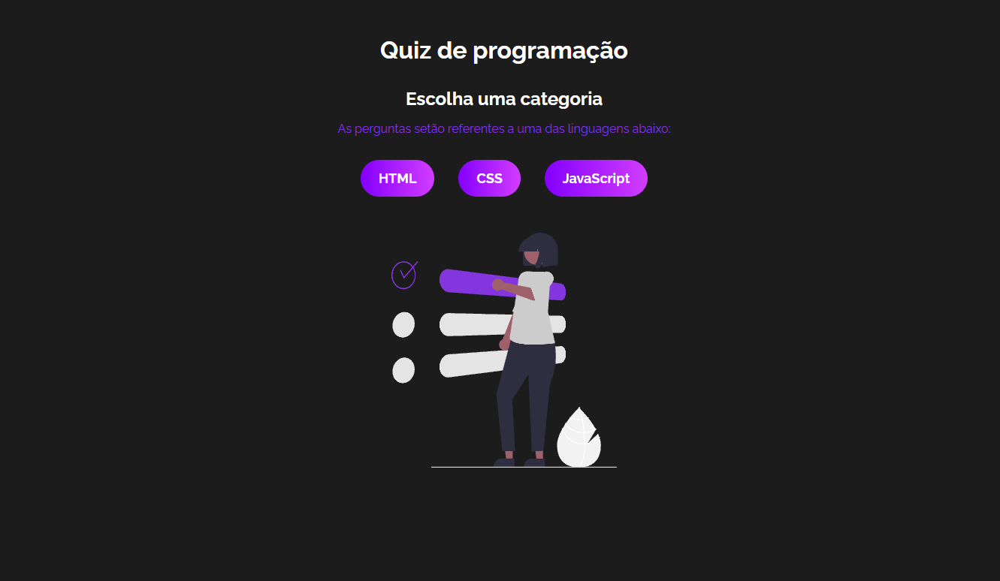
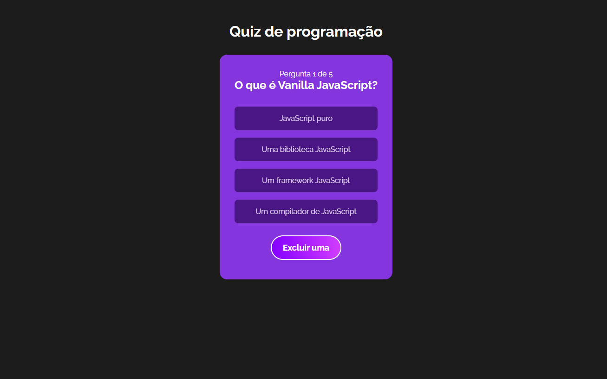

### **Estrutura Geral**
O **Quiz App** é uma aplicação de perguntas e respostas sobre programação, onde o usuário pode escolher uma categoria de perguntas (HTML, CSS, ou JavaScript) e responder a uma série de questões. O app registra a pontuação e exibe um resumo no final.

#### Seleção de tema:

#### Quiz:

### **Fluxo de Funcionamento**

1. **Tela de Boas-vindas (Welcome.jsx)**
   - Quando o aplicativo é aberto, a tela de boas-vindas é exibida. Ela contém um botão "Iniciar", que, ao ser clicado, altera o estado do jogo para que o usuário possa escolher uma categoria.

2. **Escolha de Categoria (PickCategory.jsx)**
   - Após clicar em "Iniciar", o usuário é direcionado para a tela onde ele escolhe uma categoria de perguntas (HTML, CSS, JavaScript). Cada categoria possui seu próprio conjunto de questões.
   - Quando o usuário escolhe uma categoria, as perguntas daquela categoria são embaralhadas, e o jogo é iniciado.

3. **Jogo em Progresso (Question.jsx)**
   - As perguntas da categoria escolhida são exibidas uma a uma. Para cada pergunta, o usuário pode selecionar uma das opções de resposta. O app verifica se a resposta está correta ou não e atualiza a pontuação.
   - O usuário pode utilizar dicas, como:
     - **Mostrar dica** (`SHOW_TIP`).
     - **Ocultar uma opção incorreta** (`REMOVE_OPTION`).

4. **Fim de Jogo (GameOver.jsx)**
   - Quando todas as perguntas forem respondidas ou se o jogo for finalizado, a tela de "Fim de Jogo" é exibida. Nessa tela, o usuário pode ver sua pontuação total e quantas perguntas ele acertou.
   - Há também um botão para reiniciar o quiz, que retorna o jogo ao estado inicial.

### **Estados do Jogo**
O estado do jogo é gerenciado por um contexto (`QuizContext`) que usa um **reducer** para definir as transições entre as diferentes fases do jogo. O estado controla:
   - Em qual fase do jogo o usuário está (`gameStage`): "Start", "Category", "Playing", ou "End".
   - Qual é a pergunta atual e se o usuário selecionou uma resposta.
   - A pontuação acumulada do jogador.

### **Redução de Estado**
As transições entre as fases do jogo são controladas pelo `quizReducer`, que reage a diferentes ações (como mudar de estado, verificar respostas, embaralhar perguntas, etc.). Cada ação desencadeia uma mudança no estado global do jogo, o que atualiza a interface exibida ao usuário.

### **Componentes Principais**
1. **Welcome**: Tela inicial com a opção de iniciar o jogo.
2. **PickCategory**: Exibe as categorias disponíveis e inicia o quiz com a categoria escolhida.
3. **Question**: Exibe as perguntas e opções de resposta, processa a escolha e avança para a próxima pergunta.
4. **GameOver**: Mostra o resultado do quiz e permite reiniciar o jogo.

### **Lógica de Verificação**
Cada vez que o usuário escolhe uma resposta, a ação `CHECK_ANSWER` é disparada, comparando a opção selecionada com a resposta correta. Se estiver correta, a pontuação do jogador aumenta.

### **Reiniciar o Quiz**
Após o fim do jogo, o botão "Reiniciar" dispara a ação `NEW_GAME`, que redefine o estado do jogo para o início, permitindo ao jogador jogar novamente.

Esse fluxo de jogo garante uma interação fluida entre o usuário e o aplicativo, com as diferentes fases e estados sendo controlados pelo **reducer**.
